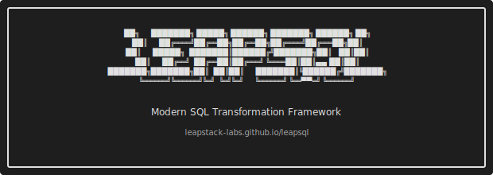

<p align="center">
  
</p>

<p align="center">
  <a href="https://goreportcard.com/report/github.com/leapstack-labs/leapsql">
    
  </a>
  <a href="https://github.com/leapstack-labs/leapsql/blob/main/LICENSE">
    
  </a>
  <a href="https://github.com/leapstack-labs/leapsql/releases">
    
  </a>
</p>

# LeapSQL

A SQL transformation framework that automatically detects dependencies from your queries. Write pure SQL, get dependency graphs, column-level lineage, and incremental builds - no `ref()` functions or boilerplate required.

## Why LeapSQL?

- **Automatic Dependency Detection** - Write standard SQL. LeapSQL parses your queries to build the DAG automatically from `FROM`, `JOIN`, subqueries, and CTEs.
- **Column-Level Lineage** - Track exactly how each field flows through your transformations, not just table-level dependencies.
- **Starlark Templating** - Use a Python-like language for safe, deterministic SQL generation. No more Jinja recursion errors.
- **Single Binary** - Distributed as a standalone Go binary. No Python environments or dependency management.
- **Database-Backed State** - Run history and metadata stored in SQLite, not scattered JSON artifacts.

## Quick Example

```sql
/*---
name: customers
materialized: table
---*/

SELECT
    c.id,
    c.name,
    c.email,
    COUNT(o.id) as order_count,
    SUM(o.amount) as total_spent
FROM raw_customers c
LEFT JOIN raw_orders o ON c.id = o.customer_id
GROUP BY c.id, c.name, c.email
```

LeapSQL automatically detects that this model depends on `raw_customers` and `raw_orders`, tracks that `order_count` derives from `orders.id`, and ensures models build in the correct order.

## Installation

### From Source

Requires Go 1.21+:

```bash
go install github.com/leapstack-labs/leapsql/cmd/leapsql@latest
```

### Pre-built Binaries

Download from the [Releases Page](https://github.com/leapstack-labs/leapsql/releases), or:

```bash
# macOS / Linux
curl -L https://github.com/leapstack-labs/leapsql/releases/latest/download/leapsql-$(uname -s)-$(uname -m) -o leapsql
chmod +x leapsql
sudo mv leapsql /usr/local/bin/
```

## Quickstart

```bash
# Create a new project
mkdir my-project && cd my-project
leapsql init --example

# Load seed data
leapsql seed

# View the dependency graph
leapsql dag

# Run all models
leapsql run
```

## CLI Commands

| Command | Description |
|---------|-------------|
| `init` | Initialize a new project |
| `run` | Execute models in dependency order |
| `list` | List all discovered models |
| `dag` | Display the dependency graph |
| `lineage` | Show upstream/downstream dependencies for a model |
| `render` | Output compiled SQL with templates expanded |
| `seed` | Load CSV files into the database |
| `docs` | Generate or serve documentation |
| `lsp` | Start the language server for IDE integration |

Run `leapsql <command> --help` for detailed usage.

## Supported Databases

| Database | Status | Notes |
|----------|--------|-------|
| **DuckDB** | Stable | Embedded, great for local development |
| **PostgreSQL** | Stable | Production-ready with pgx driver |

Configure your adapter in `leapsql.yaml`:

```yaml
adapter:
  type: duckdb
  path: ./warehouse.db
```

## IDE Support

LeapSQL includes a Language Server Protocol (LSP) implementation providing:

- Autocomplete for models and macros
- Hover documentation
- Go-to-definition

A VS Code extension is available in the `vscode-leapsql/` directory.

## Documentation

Full documentation: [leapstack-labs.github.io/leapsql](https://leapstack-labs.github.io/leapsql/)

- [Installation Guide](https://leapstack-labs.github.io/leapsql/installation)
- [Core Concepts](https://leapstack-labs.github.io/leapsql/concepts/models)
- [CLI Reference](https://leapstack-labs.github.io/leapsql/cli/)
- [Templating](https://leapstack-labs.github.io/leapsql/templating/overview)

## Contributing

Contributions are welcome. To get started:

```bash
# Run tests
task test

# Run linter
task lint

# Run both
task check
```

See the [Taskfile.yml](./Taskfile.yml) for all available commands.

## License

MIT License. See [LICENSE](./LICENSE) for details.
