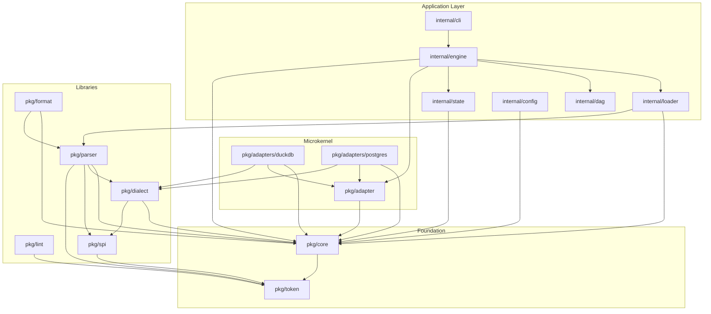

# Architecture Specification

**Pattern:** Hybrid Core-Library + Microkernel (Hexagonal)
**Status:** Planned (see [migration plan](../plans/todo/hexagonal-architecture-overview.md))

## 1. The Golden Rule

Dependencies must flow **inwards** toward `pkg/core`.

- ✅ `pkg/parser` imports `pkg/core`
- ✅ `internal/engine` imports `pkg/core`
- ✅ `pkg/core` imports `pkg/token` ONLY (foundational)
- ❌ `pkg/core` imports `pkg/spi`, `pkg/parser`, `internal/*`, `pkg/adapter`, `pkg/lint`

**Critical:** `pkg/core` imports ONLY `pkg/token` (and stdlib). NOT `pkg/spi`.
`pkg/spi` is a Mechanism Contract for the parser, not a Domain Entity.

## 2. Guiding Principle

**Separate Data (Contract) from IO (Mechanism)**

| Layer | Role | Contains |
|-------|------|----------|
| `pkg/core` | Contracts | Types + Interfaces |
| `pkg/*` | Libraries | Stateless transformations |
| `pkg/adapter` | Microkernel | Plugin registry |
| `internal/*` | Mechanisms | IO, orchestration, persistence |

## 3. Directory Roles

### A. The Hub: `pkg/core`

**Scope:** The shared language of the system.

**Content:**
- Domain Entities: `Model`, `Dialect`, `Run`, `Environment`
- Service Interfaces: `Adapter`, `Store`
- Configuration: `ProjectConfig`, `TargetConfig`, `LintConfig`

**Files:**
```
pkg/core/
├── doc.go           # Package documentation
├── model.go         # Model, SourceRef, ColumnInfo, TestConfig
├── dialect.go       # Dialect struct and all related types
├── adapter.go       # Adapter interface, AdapterConfig, Column, TableMetadata
├── state.go         # Store interface, Run, ModelRun, Environment
├── project.go       # ProjectConfig, TargetConfig, LintConfig
└── materialization.go
```

**Strictness:** Pure data and contracts only. No implementation logic.

### B. The Libraries: `pkg/*`

**Scope:** Reusable, stateless toolkits.

| Package | Purpose |
|---------|---------|
| `pkg/parser` | SQL parsing → AST |
| `pkg/format` | AST → formatted SQL |
| `pkg/lint` | SQL linting rules + analyzer |
| `pkg/dialect` | Dialect builder + registry |
| `pkg/token` | Lexical tokens |
| `pkg/spi` | Service provider interface (handler types) |

**Rule:** Must accept/return `pkg/core` types. Must not depend on CLI or Engine.

### C. The Microkernel: `pkg/adapter` & `pkg/adapters/*`

**Scope:** Database Driver Extension Point.

**Structure:**
- **Kernel (`pkg/adapter`):** Registry and factory for drivers
- **Plugins (`pkg/adapters/*`):** Implementations (DuckDB, Postgres)

```
pkg/adapter/
├── registry.go      # Register(), Get(), ListAdapters()
└── base.go          # BaseSQLAdapter shared implementation

pkg/adapters/
├── duckdb/
│   ├── adapter.go   # Implements core.Adapter
│   └── dialect/     # Builds *core.Dialect
└── postgres/
    ├── adapter.go   # Implements core.Adapter
    └── dialect/     # Builds *core.Dialect
```

**Rule:** Plugins register via `init()`. Engine uses registry, never imports plugins directly.

### D. The Application: `internal/*`

**Scope:** Application runtime with IO and side-effects.

| Package | Purpose |
|---------|---------|
| `internal/loader` | Reads SQL files → `*core.Model` |
| `internal/engine` | Orchestrates execution |
| `internal/state` | SQLite persistence (implements `core.Store`) |
| `internal/config` | YAML loading → `*core.ProjectConfig` |
| `internal/dag` | Dependency graph operations |
| `internal/cli` | Command-line interface |
| `internal/lsp` | Language Server Protocol |
| `internal/starlark` | Template execution context |
| `internal/template` | SQL template rendering |
| `internal/macro` | Starlark macro loading |
| `internal/registry` | Model path registry |
| `internal/provider` | Shared context for LSP/lint |

**Rule:** Can import any `pkg/*`. Cannot be imported by `pkg/*`.

## 4. Data Flow

```
┌─────────────────────────────────────────────────────────────┐
│                        CLI (internal/cli)                    │
└─────────────────────────────┬───────────────────────────────┘
                              │
                              ▼
┌─────────────────────────────────────────────────────────────┐
│                     Engine (internal/engine)                 │
│                                                              │
│  1. Load: loader.LoadDir() → []*core.Model                  │
│  2. Plan: dag.TopologicalSort() → execution order           │
│  3. Resolve: adapter.Get() → core.Adapter                   │
│  4. Run: adapter.Exec() for each model                      │
└─────────────────────────────────────────────────────────────┘
         │              │              │
         ▼              ▼              ▼
   ┌──────────┐  ┌──────────┐  ┌──────────┐
   │  Loader  │  │   DAG    │  │  State   │
   │ (internal)│  │(internal)│  │(internal)│
   └────┬─────┘  └──────────┘  └────┬─────┘
        │                           │
        ▼                           ▼
   ┌──────────┐              ┌──────────┐
   │  Parser  │              │  SQLite  │
   │  (pkg)   │              │   (io)   │
   └──────────┘              └──────────┘
```

## 5. Type Strategy

- **Canonical Types:** Structs shared across packages live in `pkg/core`
- **Local Types:** Package-internal types stay in their package
- **No Mapping:** Avoid duplicate types (e.g., no `parser.Model` AND `state.Model`)
- **Composition:** Use embedding for extension (e.g., `PersistedModel` embeds `*Model`)

| Type | Location | Used By |
|------|----------|---------|
| `Model` | `pkg/core` | loader, engine, registry (core identity only) |
| `PersistedModel` | `pkg/core` | state (wraps `*Model` + persistence fields) |
| `DialectConfig` | `pkg/core` | adapters, format (pure config data) |
| `Dialect` | `pkg/dialect` | parser (wraps config + SPI handlers) |
| `Adapter` | `pkg/core` | engine, adapters/* |
| `Store` | `pkg/core` | engine, state/sqlite |
| `ProjectConfig` | `pkg/core` | config, cli, engine |
| `Diagnostic` | `pkg/lint` | lint (domain-specific, stays in lint) |
| `Token` | `pkg/token` | parser, lexer (foundational) |
| `Node` | `pkg/core` | AST base interface for future SPI type safety |

## 6. Import Graph



**Key:** `pkg/core` imports ONLY `pkg/token`. `pkg/spi` is imported by `pkg/dialect` and `pkg/parser`, NOT by `pkg/core`.

## 7. Adding New Components

### New Domain Type

1. Define in appropriate `pkg/core/*.go` file
2. Ensure no forbidden imports
3. Update dependent packages

### New Database Adapter

1. Create `pkg/adapters/newdb/`
2. Implement `core.Adapter` interface
3. Create dialect in `pkg/adapters/newdb/dialect/`
4. Register in `init()` function

### New CLI Command

1. Add to `internal/cli/commands/`
2. Import from `pkg/*` and `internal/*` as needed
3. Never import from `cmd/`

## 8. Verification

Run architecture test to verify no forbidden imports in core:

```bash
go test ./pkg/core/... -run TestCoreImports
```

Run full check:

```bash
task check
```
